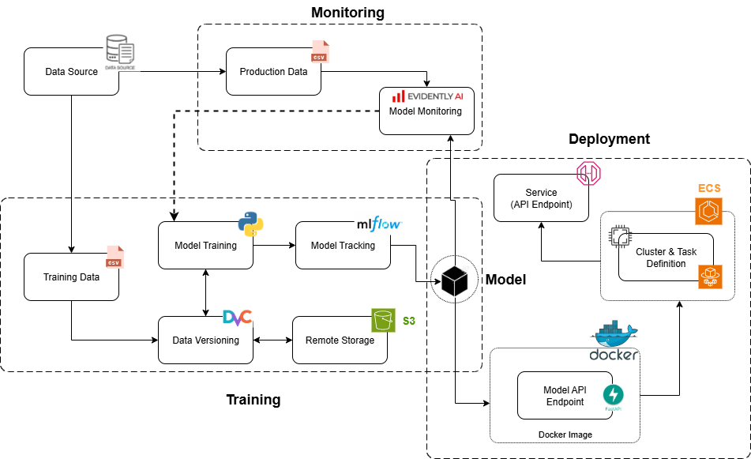

# MLops-Project: Insurance Cross Sell Prediction 🏠🏥

Welcome to the Insurance Cross-Selling Prediction project! The goal of this project is to predict which customers are most likely to purchase additional insurance products using a machine learning model.

## Diagram
Architecture diagram.


## Get Started
To get started with the project, follow the steps below:

#### 1. Clone the Repository
Clone the project repository from GitHub:
```bash
git clone https://github.com/Spek7ro/MLops-Project.git
```
```bash
cd ml-project
```

#### 2. Set Up the Environment
Ensure you have Python 3.9+ installed. Create a virtual environment and install the necessary dependencies:
```bash
python -m venv venv
source venv/bin/activate  # On Windows: venv\Scripts\activate
pip install -r requirements.txt
```
Alternatively, you can use the Makefile command:
```bash
make setup
```
#### 3. Data Preparation
Pull the data from DVC. If this command doesn't work, the train and test data are already present in the data folder:
```bash
dvc pull
```

#### 4. Train the Model
To train the model, run the following command:

```bash

```

 
